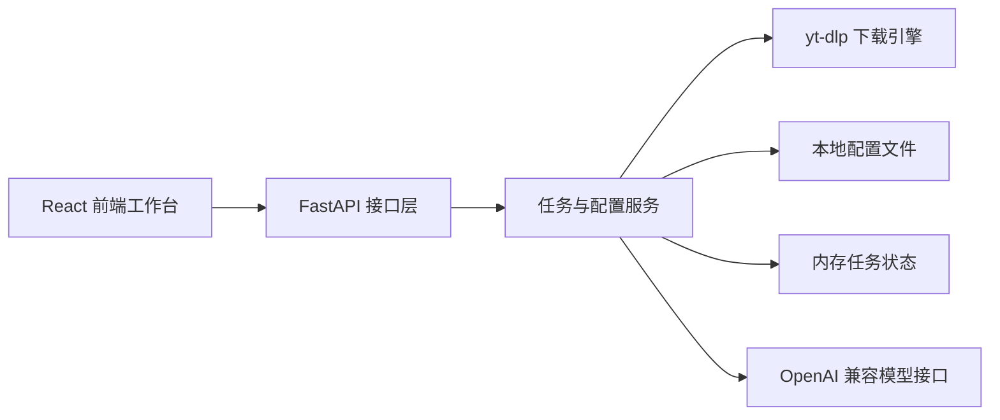
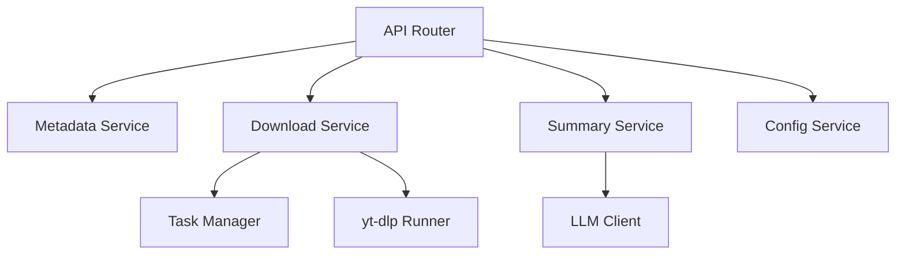
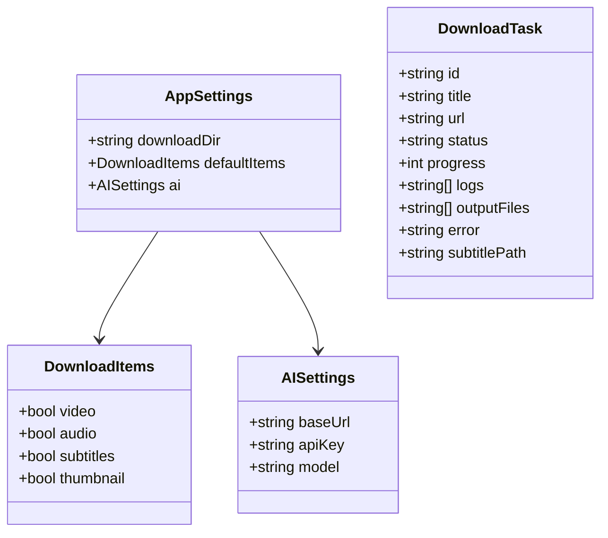

## 1. 架构设计



## 2. 技术说明

- 前端：React@18 + TypeScript + Vite
- 样式：CSS Variables + 自定义模块化样式
- 初始化工具：Vite
- 后端：FastAPI + Pydantic
- 下载引擎：yt-dlp CLI
- 数据存储：无数据库，使用 JSON 配置文件与内存态任务
- 外部服务：可选 OpenAI 兼容大模型接口

## 3. 路由定义

| 路由 | 用途 |
|-------|---------|
| / | 工作台首页 |
| /settings | 设置页 |

## 4. API 定义

### 4.1 `POST /api/parse`

请求体：

```ts
type ParseRequest = {
  url: string;
};
```

响应体：

```ts
type ParseResponse = {
  platform: string;
  title: string;
  uploader?: string;
  duration?: number;
  thumbnail?: string;
  webpageUrl: string;
  hasSubtitles: boolean;
  formats: string[];
};
```

### 4.2 `POST /api/tasks/download`

请求体：

```ts
type DownloadRequest = {
  url: string;
  items: {
    video: boolean;
    audio: boolean;
    subtitles: boolean;
    thumbnail: boolean;
  };
};
```

响应体：

```ts
type DownloadTaskResponse = {
  taskId: string;
  status: "queued" | "running" | "completed" | "failed";
};
```

### 4.3 `GET /api/tasks`

响应体：

```ts
type TaskSummary = {
  id: string;
  title: string;
  status: string;
  progress: number;
  createdAt: string;
};
```

### 4.4 `GET /api/tasks/{task_id}`

响应体：

```ts
type TaskDetail = {
  id: string;
  status: string;
  progress: number;
  logs: string[];
  outputFiles: string[];
  error?: string;
};
```

### 4.5 `GET /api/settings`

响应体：

```ts
type SettingsResponse = {
  downloadDir: string;
  defaultItems: {
    video: boolean;
    audio: boolean;
    subtitles: boolean;
    thumbnail: boolean;
  };
  ai: {
    baseUrl: string;
    apiKey: string;
    model: string;
  };
};
```

### 4.6 `PUT /api/settings`

请求体与 `GET /api/settings` 响应结构一致。

### 4.7 `POST /api/summary`

请求体：

```ts
type SummaryRequest = {
  taskId: string;
};
```

响应体：

```ts
type SummaryResponse = {
  summary: string;
  bullets: string[];
  tags: string[];
};
```

## 5. 服务端架构图



## 6. 数据模型

### 6.1 数据模型定义



### 6.2 数据定义说明

- 配置文件存储在本地 JSON 文件中
- 任务状态存储在后端进程内存中
- 下载文件落在用户指定目录
