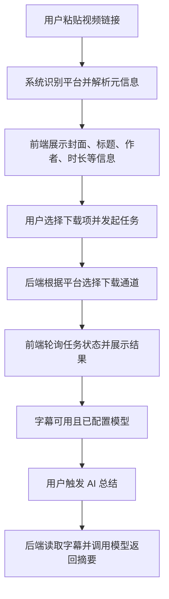

## 1. 产品概述

Video Downloader AI 是一个本地运行的跨平台视频下载与 AI 总结工作台，面向需要从 B站、YouTube、TikTok、抖音快速提取内容资产的用户。

- 解决多平台下载入口分散、操作复杂、内容难整理的问题
- 通过“链接解析 + 资源下载 + 字幕总结”提升内容获取与整理效率

## 2. 核心功能

### 2.1 功能模块

1. **工作台首页**：链接输入、平台识别、视频解析、下载选项、任务状态、AI 总结
2. **设置页**：下载目录配置、默认下载项、AI 服务配置

### 2.2 页面详情

| 页面名称 | 模块名称 | 功能描述 |
|-----------|-------------|---------------------|
| 工作台首页 | 顶部品牌区 | 展示产品定位、强调统一解析与下载能力 |
| 工作台首页 | 链接输入区 | 粘贴视频链接并触发解析 |
| 工作台首页 | 平台说明区 | 展示支持平台与能力说明 |
| 工作台首页 | 解析结果卡片 | 展示标题、作者、时长、平台、封面、字幕可用性 |
| 工作台首页 | 下载选项区 | 选择视频、音频、字幕、封面等下载项并发起任务 |
| 工作台首页 | AI 总结区 | 展示字幕摘要、核心要点、内容标签 |
| 工作台首页 | 任务列表区 | 展示任务状态、错误提示、下载结果 |
| 设置页 | 下载设置 | 配置下载目录与默认下载项 |
| 设置页 | AI 配置 | 配置 `base_url`、`api_key`、`model` |

### 2.3 平台实现策略

- `B站`：优先使用公开接口获取元信息与播放流，分别下载音视频流，并通过 `ffmpeg` 合并
- `YouTube / TikTok / 抖音`：优先通过 `yt-dlp` 统一封装
- 对会员、番剧、付费、区域限制内容给出明确提示，不向普通用户暴露 Cookie 等技术配置

## 3. 核心流程

用户在工作台输入任意支持平台的视频链接，系统自动识别平台并解析元信息。对于普通公开 B站 视频，系统优先走站内公开接口解析与取流；其他平台优先调用通用下载引擎。用户确认下载内容后，系统执行任务并持续反馈状态。当字幕可用且已配置模型时，用户可进一步生成 AI 总结。

## 4. 用户界面设计

### 4.1 设计风格

- 主色：米白、暖灰、深墨色
- 强调色：克制的深蓝灰与铜金色点缀
- 按钮风格：大圆角、低对比描边、轻微悬浮阴影
- 字体风格：标题使用更具内容气质的衬线字体，正文使用清晰的人文无衬线
- 布局风格：编辑台式布局，避免常见 SaaS 卡片拼接感
- 图标风格：线性图标搭配平台识别徽标

### 4.2 页面设计概览

| 页面名称 | 模块名称 | UI 元素 |
|-----------|-------------|-------------|
| 工作台首页 | 顶部品牌区 | 大标题、副标题、简洁导航、轻质背景纹理 |
| 工作台首页 | 链接输入区 | 大尺寸输入框、主按钮、辅助说明、即时错误提示 |
| 工作台首页 | 解析结果卡片 | 大封面、文字信息、平台徽标、状态标签 |
| 工作台首页 | 下载选项区 | 复选下载项、主次操作按钮、提示信息 |
| 工作台首页 | AI 总结区 | 摘要块、标签、要点列表、空状态提示 |
| 工作台首页 | 任务列表区 | 时间线式状态展示、进度标签、技术日志抽屉 |
| 设置页 | 配置表单 | 分组表单、保存反馈、说明文字 |

### 4.3 响应式策略

- 采用桌面优先设计
- 平板与移动端做自适应堆叠布局
- 输入框、操作按钮、下载选项在触屏环境下保证可点击区域
